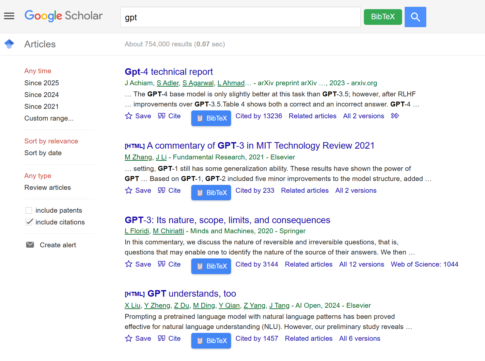
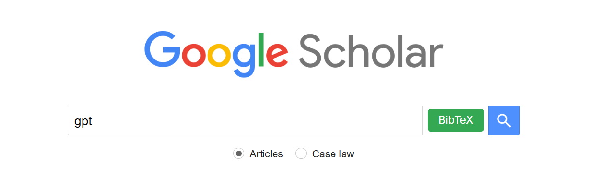
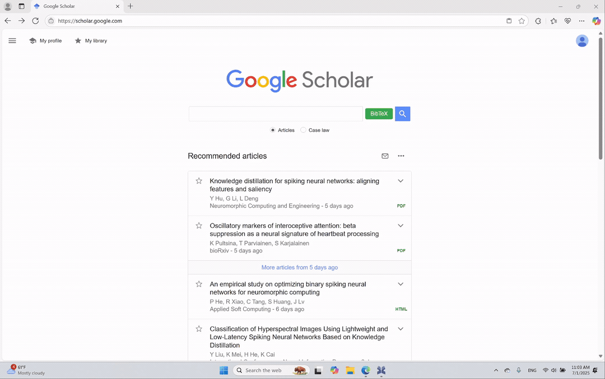

# 📚 Scholar BibTeX Helper

**IMPORTANT**: All buttons in this extension will **overwrite your clipboard content** upon use.

**If it cannot work, it might be blocked by Google. Just refresh the page with F5.**

A lightweight browser extension designed to improve your Google Scholar workflow. Whether you're managing references or doing academic research, this tool lets you quickly grab BibTeX entries with a single click.

---

## 🌟 Features

### 🔹 1. One-click BibTeX for Each Google Scholar Item
Each search result on Google Scholar will include an extra button labeled **BibTeX** 📋, allowing you to directly copy the BibTeX entry to your clipboard without opening any citation dialog.

🖼️ *Example screenshot:*  

---

### 🔹 2. Global "Get First BibTeX" Button (Top Bar)

Adds a green **BibTeX** button next to the search bar at the top of the Google Scholar page.  
Clicking it will automatically grab the BibTeX entry of the **first search result**.

🖼️ *Example screenshot:*  

---

### 🔹 3. Batch Mode via Right Click

Right-click the global green **BibTeX** button to enter batch mode.  
You’ll see a popup where you can enter multiple titles (one per line). The extension will then process them one by one, opening Google Scholar in new tabs and copying the BibTeX entries for each.

🖼️ *Example screenshot:*  

<!--  -->

---

## 🧩 How to Install (ZIP Import)

If the extension is not yet in the Chrome Web Store, you can manually install it via ZIP:

1. Download the `.zip` file and extract it to a folder.
2. Open **Chrome** and go to `chrome://extensions/`.
3. Enable **Developer mode** (toggle in the top right).
4. Click **"Load unpacked"**.
5. Select the folder where you extracted the ZIP.

That's it! Now go to [Google Scholar](https://scholar.google.com) and enjoy your academical career. ✨

---

## 📝 Notes

- This extension is **non-intrusive** and only modifies the Google Scholar search results page.
- All BibTeX content is copied directly to your clipboard.
- No data is collected, and everything runs locally in your browser.

---

## 📬 Coming Soon

✅ Publishing to Chrome Web Store  
✅ Optional settings panel  
✅ Better UI customization  

---

Happy citing! 😊  

